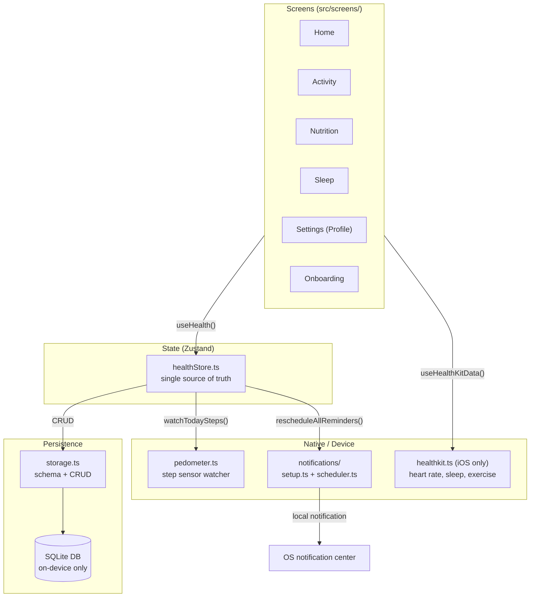
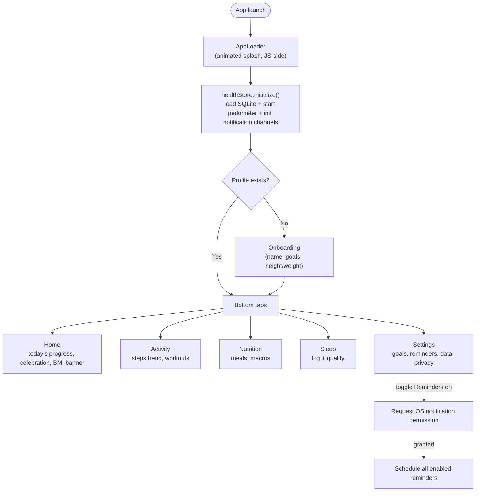
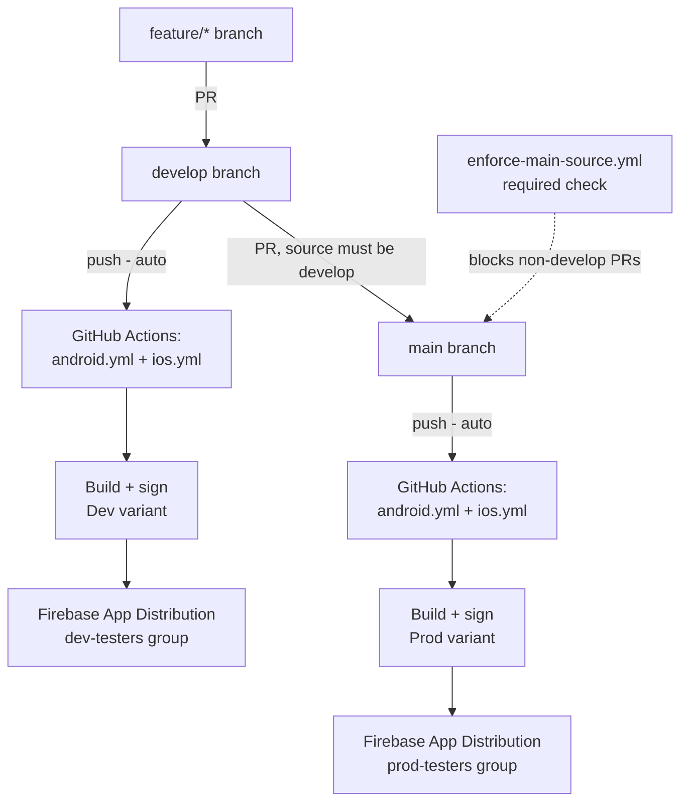

# PocketVitals

A fully local, offline-first health tracker built with React Native + Expo.
It tracks **steps, water, sleep, weight, workouts, and meals** — all stored
in an on-device SQLite database. There is no backend, no accounts, no
network sync, and no analytics. Uninstalling the app deletes the data.

Two installable variants ship from the same codebase: a **Dev/UAT** build
(`com.harryharihar.pocketvitals.dev`, orange icon) and a **Prod** build
(`com.harryharihar.pocketvitals`, green icon), so both can sit on the same
device at once.

---

## Tech stack

| Layer | Choice |
|---|---|
| Framework | Expo SDK 54, React Native 0.81, React 19 |
| Language | TypeScript (`strict: false`) |
| State | Zustand (single store, `src/store/healthStore.ts`) |
| Storage | `expo-sqlite` — the only place SQLite is opened/queried |
| Navigation | React Navigation (bottom tabs) |
| Charts / UI | `react-native-svg`, `expo-linear-gradient` — hand-drawn, no chart library |
| Notifications | `expo-notifications` (local only — no push server) |
| Health data | `expo-sensors` `Pedometer` (both platforms), `@kingstinct/react-native-healthkit` (iOS heart rate/sleep/exercise) |
| CI/CD | GitHub Actions, Fastlane (`match` for iOS signing), Firebase App Distribution |

---

## Architecture



Every screen reads and writes through `useHealth()` — never through
`expo-sqlite` directly. The store is the only thing that knows both the
storage layer and the device sensors exist.

---

## App flow



---

## Project structure

```
App.tsx                          Root: providers, loading gate, onboarding gate
app.config.js                    Dynamic config (Dev vs Prod) — see "Environments" below
plugins/                         Custom Expo config plugins (see below)
fastlane/                        iOS signing/build automation (CI only)
.github/workflows/               CI/CD pipelines (see below)

src/
  theme/            Design tokens (colors, spacing, radius, glow) — dark + light palettes
  storage/          storage.ts — SQLite schema, migrations, one generic logTable() helper
  store/            healthStore.ts — Zustand store, all CRUD + derived "today" totals
  navigation/       Bottom tab navigator + route name constants
  notifications/    Permission handling + reminder scheduling
  health/           iOS HealthKit integration (heart rate, sleep, exercise minutes)
  components/       Shared UI: Card, EntryDialog, QuickAddSheet, Sparkline, DailyArc, ...
  screens/          One folder per screen: Screen.tsx (view) + useXScreen.ts (logic/state)
  utils/            dateUtils, healthCalculations, pedometer, stepsOffset
  constants/        labels.ts (every user-facing string), genderOptions
  data/             foodDatabase.ts, policyContent.ts (Privacy Policy / Terms)
  types/            Shared TypeScript models
```

Each screen follows the same split: `ScreenName.tsx` is the view (JSX only),
`useScreenName.ts` owns all state and derived data, `ScreenName.styles.ts`
holds the `StyleSheet`. This keeps screens easy to test/reason about without
digging through render logic to find where a number comes from.

---

## Data model

SQLite tables (see `src/storage/storage.ts`):

| Table | Purpose |
|---|---|
| `profile` | Name, age, gender, height, weight, goals (single row) |
| `settings` | Dark mode, reminders enabled, notification time (single row) |
| `water_logs`, `sleep_logs`, `steps_logs`, `weight_logs` | One row per entry, `{ id, timestamp, ...fields }` |
| `workouts`, `meals` | Type/name + computed calories, macros, distance |
| `reminders` | User-defined notification schedules (category, daily-time or interval) |

Every log table is generated through one generic `logTable()` factory
rather than hand-written query functions per table — adding a new log type
is a one-line call, not a new file.

Steps have both a **manual** path (`addSteps`) and an **automatic** path
(`syncAutoSteps`, driven by the device pedometer); both write into the same
`steps_logs` table, with the auto-tracked entry being a single upserted row
per day (`id: auto-${todayKey()}`).

---

## Core algorithms

**Step tracking** (`src/utils/pedometer.ts`) — the two platforms need
different strategies since neither exposes the same primitive:

- **iOS**: `Pedometer.getStepCountAsync(midnight, now)` returns an
  authoritative historical total directly from Core Motion — just re-queried
  on an interval. Always correct, no accumulation logic needed.
- **Android**: `Pedometer.watchStepCount()` only streams a *delta since the
  current subscription started*, not since midnight. A baseline (persisted
  in AsyncStorage) is added on top of each delta to reconstruct "today's
  total," and re-subscribing at midnight resets that baseline for the new
  day. A **settle window** (first 4 seconds after a fresh subscription)
  filters out the 1-2 phantom "steps" the sensor picks up from handling the
  phone — most noticeable right after install, before real walking exists
  to drown the noise out.

**BMI** (`healthCalculations.ts`): standard `weight(kg) / height(m)²`,
bucketed into Underweight (<18.5) / Normal (18.5–25) / Overweight (25–30) /
Obese (≥30).

**Calorie/distance estimates from steps**: `steps × 0.04` kcal,
`steps × 0.762m` distance (average stride) — rough, not a substitute for a
real accelerometer-based estimate, but requires no extra sensor data.

**Workout calories**: standard ACSM formula,
`kcal/min = MET × 3.5 × weight(kg) / 200`, with a MET table per workout
type (Run 9.8, HIIT 8, Cycle 7.5, Strength 5, Walk 3.5, Yoga 3).

**Sleep stages**: HealthKit provides real stage data on iOS when available;
otherwise, the logged total is split using typical adult proportions (deep
24%, light 53%, REM 20%, awake 3%) — the *total* is always real logged data,
only the stage breakdown is estimated.

**Notification scheduling** (`notifications/scheduler.ts`): reminders are
either `daily` (fixed clock time) or `interval` (repeats every N minutes,
minimum 60s — an OS requirement). Every reschedule cancels and re-creates
*all* reminders rather than diffing, so it can never stack duplicates or
leave a deleted reminder still firing. Notifications are marked
`interruptionLevel: 'timeSensitive'` so iOS delivers them immediately
instead of silently deferring them into a batched "Scheduled Summary"
digest — a real bug we hit where reminders looked correctly scheduled but
were being delayed for hours by an iOS system setting most users don't know
exists.

Permission is only ever requested from an explicit user action (flipping
the Reminders toggle) — requesting it automatically on launch is the kind
of premature prompt that gets permanently denied.

---

## Environments (Dev vs Prod)

`app.config.js` reads `APP_ENV` at build time and produces two variants
from the same source:

```js
APP_ENV=dev         -> "PocketVitals Dev", orange icon, com.harryharihar.pocketvitals.dev
APP_ENV=production  -> "PocketVitals",     green icon,  com.harryharihar.pocketvitals
                        (default when APP_ENV is unset)
```

### Custom config plugins (`plugins/`)

`expo prebuild --clean` regenerates the native `android/`/`ios/` folders
from scratch on every run, which used to silently wipe several hand-written
native fixes. Each one is now a proper Expo config plugin instead, applied
automatically on every prebuild rather than needing manual reapplication:

| Plugin | Fixes |
|---|---|
| `withNodeBinaryFix` | Gradle daemon can't find `node` when it's managed by nvm (not on the daemon's PATH) |
| `withAndroidReleaseSigning` | Adds a `release` signingConfig that reads the keystore from CI env vars |
| `withSplashWindowBackground` | White flash between the OS splash screen and first React Native paint |
| `withoutPushEntitlement` | Strips the `aps-environment` entitlement `expo-notifications` adds unconditionally — this app never uses remote push, and the ad-hoc provisioning profile doesn't have that capability |

---

## CI/CD pipeline



**Branch rules**: both `develop` and `main` require a PR (no direct pushes,
no force-push, no deletion). A dedicated required check
(`enforce-main-source.yml`) additionally blocks any PR into `main` whose
source branch isn't `develop` — feature branches can only ever land in
`develop` first.

**Android** (`android.yml`, `ubuntu-latest`): `expo prebuild --clean` →
decode the release keystore from a base64 secret → `./gradlew
assembleRelease` (signed via the `withAndroidReleaseSigning` plugin) →
upload to Firebase App Distribution.

**iOS** (`ios.yml`, `macos-latest`): `expo prebuild --clean` → Ruby/Bundler
→ `fastlane` (see `fastlane/Fastfile`):
1. Create a dedicated CI keychain with a random password — without this,
   `codesign` needs to prompt for keychain access, which just hangs forever
   on a headless runner with no UI to show the prompt (this cost ~2 hours of
   debugging the first time).
2. `match(type: 'adhoc', readonly: true)` — fetches the cert + provisioning
   profile from a private, encrypted certificates repo (never generates new
   ones in CI).
3. Manually switch the Xcode project to manual signing pointed at that
   exact profile — Xcode's "Automatic" signing tries to fetch a Development
   profile via a live session in a headless context, ignoring the AdHoc
   profile match already installed.
4. `build_app` (archive + export as `.ipa`) — workspace/scheme are
   discovered via `Dir.glob`, not hardcoded, since `expo prebuild --clean`
   names them after the app's display name, which differs between Dev
   ("PocketVitals Dev") and Prod ("PocketVitals").
5. Upload to Firebase App Distribution via the `firebase-tools` CLI
   directly (the common GitHub Action for this is a Linux-only Docker
   container action, incompatible with the macOS runner this job needs).

Both platforms get a strictly increasing version code / build number
(`github.run_number`) on every CI build, so a new build always installs
cleanly over the previous one.

**Required secrets** (GitHub repo secrets): Android keystore + passwords;
Apple App Store Connect API key (ID, issuer, `.p8` content); `fastlane
match` git URL/password; Firebase service account JSON + one App ID per
platform per environment (4 total).

---

## Running it locally

```bash
npm install
npx expo start
```

Press `i` for iOS simulator, `a` for Android emulator, `w` for web, or scan
the QR code with **Expo Go**. For a full native debug build on a physical
device instead of Expo Go:

```bash
npx expo run:android   # or: npx expo run:ios
```

Requires Node 18+.

---

## Data & privacy

- No analytics, no network calls, no third-party SDKs, no accounts.
- **Clear All Data** (Settings → Data & Storage) wipes every SQLite table.
- **Reset Today's Steps** (Settings → Data & Storage) clears just the
  auto-tracked step count for today, without touching anything else — for
  when the step sensor picks up a false-positive reading.
- Full policy text lives in `src/data/policyContent.ts`, shown in-app under
  Settings → About.

## License

All rights reserved — see [`LICENSE`](./LICENSE). This repository is public
for portfolio/demonstration purposes; it is not open source and reuse,
modification, or redistribution is not permitted without permission.
